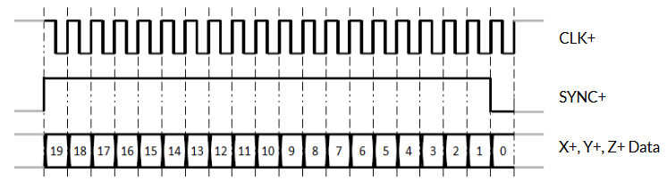

# An Arduino implementation for the XY2-100 laser scanner protocol

### Protocol overview

The XY2-100 protocol uses 4 (at minimum) pairs of wires in order to send data packets in a differential manner.

This is what a standard 16-bit data packet looks like. 

### Demo

### FAQ:

- Is 18-bit extended mode supported? No, not as of now.

- Does this work at the standard rate of 2MHz? Most likely not, but an Arduino Nano seems to be able to drive a galvo just fine. 
  
[References](docs/)